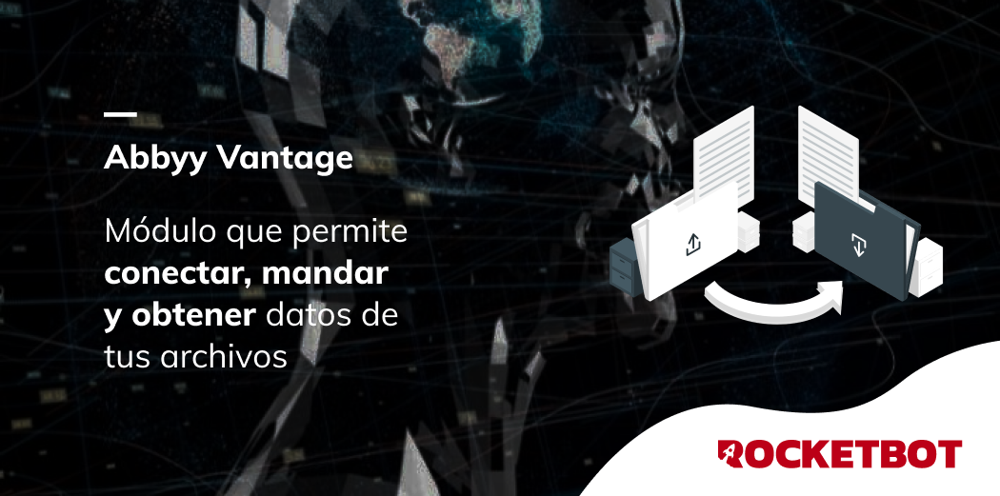

# Abbyy Vantage
  
Módulo para enviar archivos y realizar habilidades con Abbyy Vantage.  

*Read this in other languages: [English](Manual_Abbyy_Vantage.md), [Español](Manual_Abbyy_Vantage.es.md).*
  

## Como instalar este módulo
  
__Descarga__ e __instala__ el contenido en la carpeta 'modules' en la ruta de Rocketbot.  

## Descripción de los comandos

### Conectar a Abbyy Vantage
  
Conectar a Abbyy Vantage
|Parámetros|Descripción|ejemplo|
| --- | --- | --- |
|Nombre de usuario|Nombre de usuario de Abbyy Vantage|usuario|
|Password|Password de Abbyy Vantage|********|
|Asignar resultado a variable|Variable donde se almacenará el resultado de la conexión|Variable|

### Subir imagen para analizar
  
Subir una imagen para analizar
|Parámetros|Descripción|ejemplo|
| --- | --- | --- |
|Seleccione el skill a usar|Skill a usar|skill|
|Seleccionar un archivo|Archivo a analizar|C:/Usuario/Documentos|
|Asignar resultado a variable|Variable donde se almacenará el resultado|Variable|
